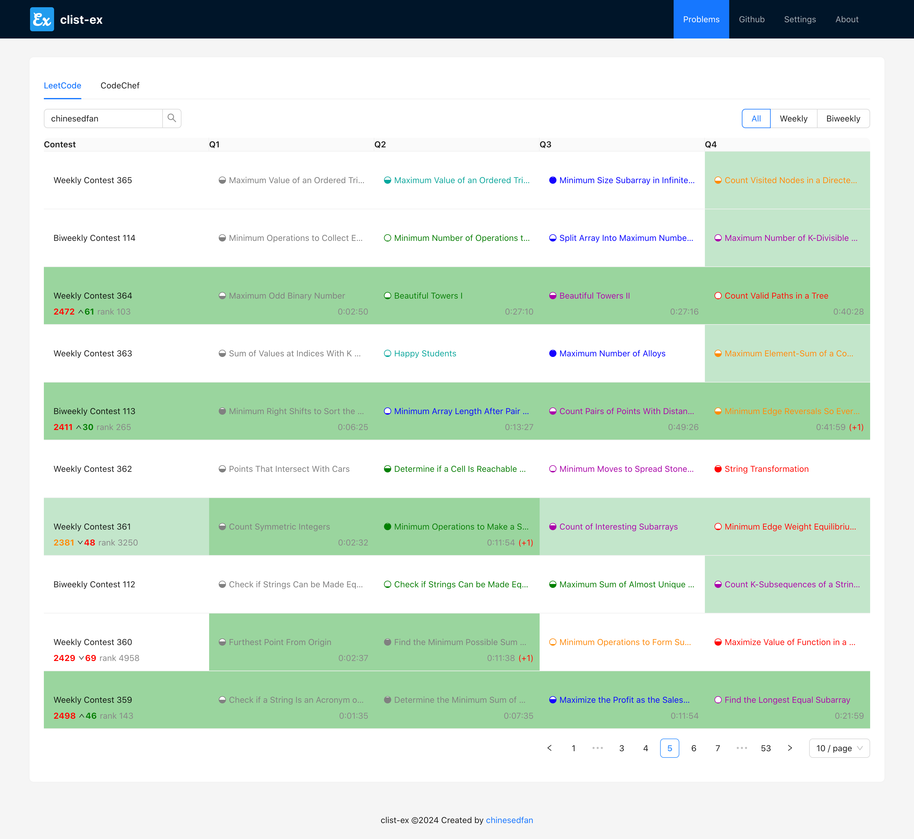
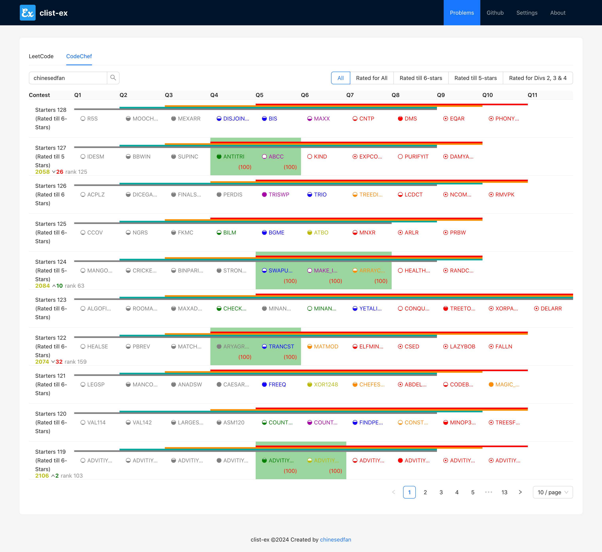

# clist-ex

This project was bootstrapped with [Create React App](https://github.com/facebook/create-react-app), as an extension based on the great website [clist.by](https://clist.by/).

It adds contest dashboard for LeetCode and CodeChef, which is inspired by [cftracker](https://cftracker.netlify.app/) and [kenkoooo/AtCoderProblems](https://kenkoooo.com/atcoder#/).

## Core Dependencies

React + Antd/SASS + Axios

## Cache

We save cache data in browser's IndexedDB, with fixed ObjectStore names.

- db: clist-ex
    - store: contest-lc
    - store: contest-cc
- db: statistics-<account_id>
    - store: statistics

## Similar Repository

- [huxulm/lc-rating (for LeetCode CN)](https://github.com/huxulm/lc-rating)
